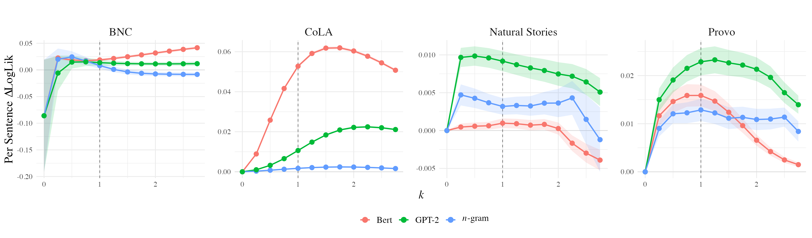
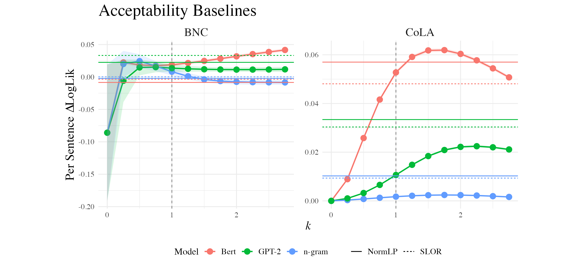
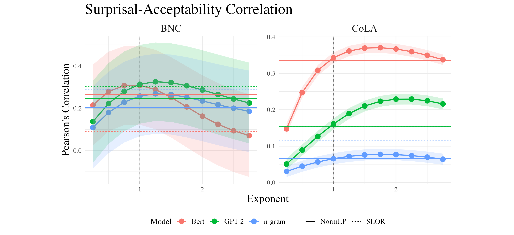
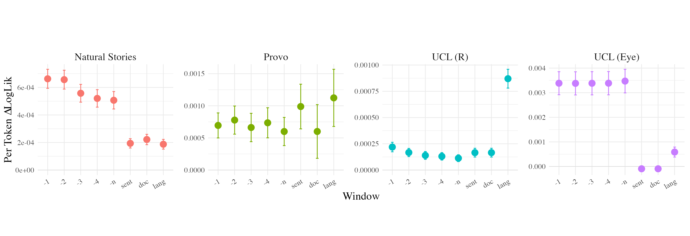
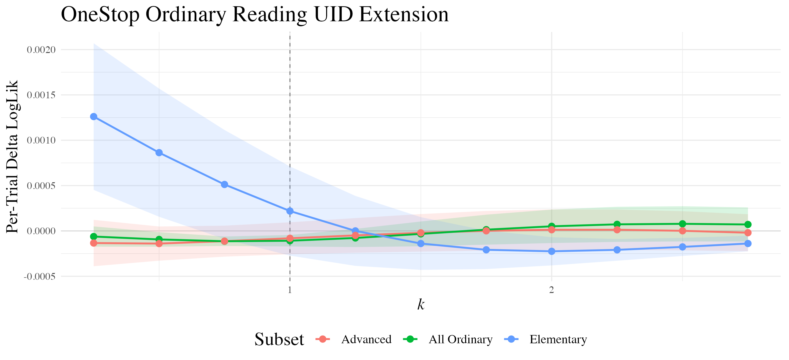
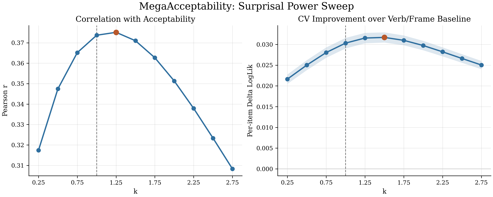
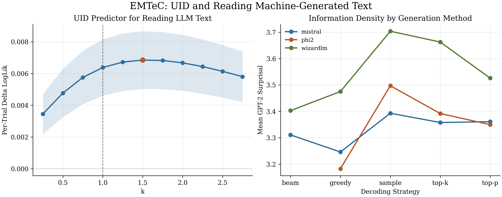

# Revisiting the Uniform Information Density Hypothesis: Replication Study

**Credit.** This replication study is based on and adapted from the original [`rycolab/revisiting-uid`](https://github.com/rycolab/revisiting-uid.git) repository for the EMNLP 2021 paper "Revisiting the Uniform Information Density Hypothesis."

## What This Project Is

This repository is a course-project replication of the main empirical analyses from "Revisiting the Uniform Information Density Hypothesis." The original paper asks whether human processing difficulty is best predicted by linear surprisal, as a strict UID account might suggest, or by transformations of surprisal that allow non-linear effects.

Our replication focuses on the part of the paper that can be rerun with publicly available data:

- acceptability judgments from CoLA and BNC
- sentence-level reading-time analyses for public datasets, especially Natural Stories and Provo
- comparison of sentence surprisal transformed by different exponents `k`
- comparison against the paper's baseline acceptability predictors, SLOR and NormLP

The practical target is not to reproduce every appendix number exactly. Instead, the goal is to recover the paper's main qualitative pattern under a modern local environment and document where data availability or package drift prevents exact reproduction.

In that sense, this repository should be read as a successful replication of a well-defined public subset of the original project, not as a complete reproduction of every dataset, model, and appendix analysis from the original repository.

## What We Changed

The original repository is preserved as the historical base, but this replication adds a more reproducible public-data workflow:

- a root-level `Makefile` for setup, data preparation, model building, and notebook execution
- `scripts/check_replication_env.py` to verify Python, R, KenLM, and data prerequisites
- `scripts/prepare_public_data.sh` to download and organize public datasets
- `scripts/build_wiki_arpa.sh` to build the WikiText-103 KenLM 5-gram model
- `scripts/build_public_replication_notebook.py` to generate `src/revisiting-uid-public.ipynb`
- a public notebook path that skips unavailable Brown/Dundee/GECO inputs when needed
- a modernized plotting style for the acceptability baseline figure
- committed summary figures and compact result CSVs for easier GitHub inspection

Large generated data, intermediate checkpoints, executed notebooks, and the KenLM ARPA file are intentionally ignored by git. Compact summary CSVs and final figures are committed so the project can be inspected directly on GitHub.

## Data Availability

The public workflow can use:

- CoLA
- BNC
- Natural Stories
- Provo
- UCL self-paced reading and eye-tracking files
- WikiText-103 for the 5-gram language model

The following original datasets are treated as unavailable or optional in this replication:

- Brown: the original Google Drive archive referenced by the upstream code currently returns `404`
- Dundee: the upstream README states that access requires contacting the original authors
- GECO: referenced by the notebook, but not downloaded by the provided public-data scripts

One original model branch is also not included in the public rerun:

- TransfoXL: the upstream notebook includes a `transxl` path, but the corresponding Hugging Face `TransfoXL` stack is deprecated and is not compatible with the current environment used for this replication. The public notebook therefore keeps GPT-2, BERT, and the KenLM 5-gram model, and skips TransfoXL.

Because of these constraints, the strongest claims in this repository are about the public subset that successfully executes locally: CoLA/BNC acceptability, the available public reading-time datasets, and the GPT-2/BERT/5-gram model comparisons. It is not a full reproduction of the original project's complete data and model coverage.

## How To Run

Clone the repository with submodules:

```bash
git clone --recursive git@github.com:luozt20/Revisiting-the-Uniform-Information-Density-Hypothesis-A-Replication-Study.git
cd Revisiting-the-Uniform-Information-Density-Hypothesis-A-Replication-Study
```

If you already cloned without submodules, run:

```bash
git submodule update --init --recursive
```

Set up the Python and R environment:

```bash
make check-env
make install
make install-r
```

Build KenLM and prepare the public datasets:

```bash
make build-kenlm
make download-public-data
make build-wiki-arpa
```

Generate and run the public replication notebook:

```bash
make public-notebook
make run-public-replication
```

Run the simulated-data verification checks for AI-assisted analysis code:

```bash
make verify-ai-assisted-analysis
```

The executed notebook is written to:

```text
src/revisiting-uid-public.executed.ipynb
```

Figures are written to:

```text
src/figures/
```

Checkpoints and intermediate tables are written to:

```text
src/checkpoints/
```

The AI-assisted analysis verification summary is written to:

```text
src/checkpoints/ai_assisted_analysis_verification.txt
```

## Expected Outputs

The public notebook should produce the main replication artifacts:

- `figure_reading_acceptability_delta_loglik`: power-sweep comparison for reading time and acceptability
- `figure_acceptability_baselines`: acceptability power sweep compared with SLOR and NormLP baselines
- `figure_surprisal_acceptability_correlation`: correlation between transformed surprisal and acceptability
- `figure_case_study3_windows`: comparison of alternative context windows where public data supports it

The most useful committed CSV checkpoints for inspection are:

- `src/checkpoints/acceptability_cv.csv`
- `src/checkpoints/lau_acceptability_cv.csv`
- `src/checkpoints/reading_time_cv.csv`
- `src/checkpoints/case_study2_variance.csv`
- `src/checkpoints/case_study3_all_vars.csv`
- `src/checkpoints/ai_assisted_analysis_verification.txt` after running `make verify-ai-assisted-analysis`

Larger intermediate feature tables and model-score caches are still ignored because they are reproducible outputs rather than source files.

## Source, Figure, And Citation Provenance

All report figures are generated by this repository's code from cited datasets and committed under `src/figures/`. No AI-generated illustrations, figures, tables, experimental stimuli, or synthetic result figures are used as final project evidence.

The final report cites the original UID paper, the public datasets, and the model/software sources used in the replication. The project README and report should not treat AI output as a source: factual claims are tied either to repository outputs or to the cited papers/dataset documentation. The main external sources are:

- original replication code and paper: [`rycolab/revisiting-uid`](https://github.com/rycolab/revisiting-uid.git) and Meister et al. (2021)
- datasets: CoLA, BNC acceptability, Natural Stories, Provo, UCL auxiliary data, OneStop, MegaAcceptability, EMTeC, and WikiText-103
- scoring tools and models: GPT-2, BERT, Hugging Face Transformers, and KenLM

Before submission, each citation in the report bibliography should be checked against the retrievable paper or dataset page, including title, authors, year, venue, DOI, and URL where applicable.

## AI Use And Verification

This project used ChatGPT/Codex as a supportive tool, subject to the course AI policy. The tool was used for codebase inspection, README/report organization, proofreading, LaTeX compilation debugging, plotting-code cleanup, and boilerplate/scaffolding for the public workflow and three-model extension runner.

AI tools were not used to generate experimental stimuli, fabricate data, invent results, draft substantive report text, or create final figures directly. All plots in `src/figures/` are generated by executable project code from cited datasets or checkpoint CSVs. The authors are responsible for the final code, prose, and scientific claims, and should be able to explain the implementation.

The main AI-assisted analysis component is:

```text
src/extension_three_model_analysis.py
```

To comply with the course verification requirement, this repository includes a simulated-data verification script:

```text
src/verify_ai_assisted_analysis.py
```

It checks that:

- UID power features obey the expected math on a sentence with known word surprisals
- the held-out CV power sweep recovers a known `uid_power_1.5` signal from simulated data
- the verification can run without downloading corpora or loading GPT-2/BERT/KenLM models

Run it with:

```bash
make verify-ai-assisted-analysis
```

Expected terminal output:

```text
PASS: UID feature math and CV power sweep recover the simulated ground-truth signal.
```

## Additional Extension: OneStop

The current three-model extension runner is implemented in:

```text
src/extension_three_model_analysis.py
```

The three-model extension runner downloads the OneStop Ordinary Reading word-level Interest Area Report,
aggregates it into paragraph-level participant trials, scores every paragraph with GPT-2, BERT, and the
WikiText-103 KenLM 5-gram model, and tests whether the UID power-sweep pattern generalizes to OneStop
Advanced vs Elementary text versions.

To generate and run it:

```bash
make run-onestop-extension
```

The extension writes:

- `src/checkpoints/onestop_ordinary_trial_features.csv`
- `src/checkpoints/onestop_ordinary_lm_text_features.csv`
- `src/checkpoints/onestop_ordinary_uid_cv.csv`
- `src/figures/figure_onestop_ordinary_uid_by_difficulty.png`

## Additional Extension: MegaAcceptability

The current three-model extension runner is implemented in:

```text
src/extension_three_model_analysis.py
```

The three-model extension runner downloads MegaAcceptability v1.2, uses the normalized clause-embedding
acceptability scores, scores each sentence with GPT-2, BERT, and the WikiText-103 KenLM 5-gram model, and
tests whether the acceptability-side super-linear surprisal pattern generalizes to this new structured
acceptability dataset.

To generate and run it:

```bash
make run-mega-acceptability-extension
```

The extension writes:

- `src/checkpoints/mega_acceptability_lm_features.csv`
- `src/checkpoints/mega_acceptability_three_model_features.csv`
- `src/checkpoints/mega_acceptability_uid_correlations.csv`
- `src/checkpoints/mega_acceptability_uid_cv.csv`
- `src/figures/figure_mega_acceptability_uid_power_sweep.png`

## Additional Extension: EMTeC

The current three-model extension runner is implemented in:

```text
src/extension_three_model_analysis.py
```

The three-model extension runner downloads the public EMTeC corrected reading measures and stimuli metadata,
aggregates word-level eye-tracking measures into participant-text trials, scores every generated text with
GPT-2, BERT, and the WikiText-103 KenLM 5-gram model, and tests whether `surprisal^k` predictors explain
total fixation time when people read LLM-generated text. It also compares information-density profiles across
generation models and decoding strategies. The runner intentionally does not download the separate 340GB
model-internal tensor release.

To generate and run it:

```bash
make run-emtec-extension
```

The extension writes:

- `src/checkpoints/emtec_text_uid_features.csv`
- `src/checkpoints/emtec_trial_features.csv`
- `src/checkpoints/emtec_lm_text_features.csv`
- `src/checkpoints/emtec_uid_cv.csv`
- `src/checkpoints/emtec_decoding_uid_summary.csv`
- `src/figures/figure_emtec_uid_generated_text.png`

## Visual Results

The most important plots are committed under `src/figures/` so the replication can be read directly on GitHub.

### Main Replication

The core public replication compares surprisal power transforms across reading-time and acceptability datasets. The acceptability panels show clearer variation across `k`; the public reading-time panels are flatter, which matches the original paper's more cautious reading-time conclusion.



The acceptability baseline figure compares `surprisal^k` predictors with SLOR and NormLP. This makes the replication more conservative: the result is not simply that any transformed surprisal predictor automatically beats every existing acceptability baseline.



The correlation plot gives the most direct acceptability-side visualization: sentence acceptability is more strongly correlated with transformed surprisal than with a strictly linear `k = 1` setting in several model/dataset combinations.



The windowed UID analysis checks whether a more local or more global notion of information density is more predictive where the public data supports the comparison.



### Additional Extensions

OneStop is a new ordinary-reading eye-tracking corpus. Its paragraph-level reading-time result is close to zero overall across GPT-2, BERT, and the 5-gram model. The best exponents are sometimes above `k = 1`, but the gains are tiny and model-dependent, so this is best read as a boundary-condition result: the clear acceptability pattern does not automatically transfer to this aggregation of ordinary reading.



MegaAcceptability is the strongest extension result. The correlation and controlled CV panels compare GPT-2, BERT, and the 5-gram model. GPT-2 and the 5-gram model peak above `k = 1`, while BERT peaks below `k = 1`; all three still show strong predictive signal beyond the controlled baseline. The acceptability-side generalization is therefore robust, but the exact preferred exponent is model-dependent.



EMTeC is the stretch extension on LLM-generated text. The reading-time effect is modest across the three scoring models: GPT-2 shows the clearest weakly super-linear peak, BERT is closest to linear, and the 5-gram model is weaker. The normalized decoding-strategy panel shows that generation choices change the information-density profile readers encounter, with sampling and top-k generally higher-surprisal than greedy search within a scoring model.



## Results And Conclusions

The original paper's conclusion is nuanced: reading-time results are broadly compatible with earlier linear-surprisal findings, but also leave room for a weakly super-linear effect; acceptability judgments give clearer evidence that non-uniform information density predicts lower acceptability; and global, language-level operationalizations of UID tend to explain the psychometric data better than local alternatives.

Our public replication recovers the clearest part of that conclusion for the data that can be rerun locally. Transformed surprisal often improves prediction over the linear `k = 1` baseline in acceptability judgments, while the public reading-time results show smaller and less decisive differences across `k`.

In the local public-data run:

- CoLA shows best-performing exponents above `k = 1` for BERT, GPT-2, and the 5-gram model.
- BNC shows a strong super-linear pattern for BERT, while GPT-2 and the 5-gram model are less consistently super-linear in this local run.
- SLOR and NormLP remain competitive baselines in some acceptability settings, so the result is not simply that every transformed-surprisal model dominates every baseline.
- Public reading-time results are weaker than acceptability results. Natural Stories and Provo show only small differences across `k`, which is consistent with the paper's claim that reading-time evidence does not reject a linear surprisal account even though weak super-linearity remains plausible.

Overall, this replication supports the original paper's broad contrast for the public subset we could rerun: acceptability judgments provide clearer evidence for non-linear UID-related effects than reading-time data, while the available reading-time results remain compatible with both linear surprisal and weak super-linear UID interpretations. Exact numerical agreement with the complete original project is not expected because Brown/Dundee/GECO are not fully available in this workflow, TransfoXL is skipped for compatibility reasons, and modern Python/R/Hugging Face dependencies differ from the original release environment.

For the OneStop extension, the result is more cautious. In ordinary reading, adding paragraph-level `surprisal^k` predictors from GPT-2, BERT, or the 5-gram model yields only very small changes over length/frequency baselines. Some model/subset combinations peak above `k = 1`, but the signs and magnitudes are not stable enough to claim a robust UID effect. This should be interpreted as a boundary-condition result for the current extension design, not as a refutation of the original paper: OneStop is a new eye-tracking corpus, the analysis is paragraph-level rather than the original sentence-level setup, and this extension currently uses only the ordinary-reading regime.

For the MegaAcceptability extension, the result is more directly supportive of the original acceptability conclusion, but less uniform than the earlier single-model version suggested. GPT-2 peaks at `k = 1.25` in controlled CV (`∆LogLik = 0.1759`) and `k = 1.5` in correlation (`r = 0.519`), while the 5-gram model peaks at `k = 1.5` in CV (`∆LogLik = 0.0316`) and `k = 1.25` in correlation (`r = 0.375`). BERT is also predictive, but peaks at `k = 0.5` in both diagnostics. Thus, MegaAcceptability strongly supports an acceptability-side surprisal effect beyond lexical/frame controls, but the exact UID exponent depends on the scoring model.

For the EMTeC extension, the result is a modest but interesting reading-time generalization to LLM-generated text. The grouped 5-fold CV analysis now compares GPT-2, BERT, and the 5-gram model for predicting log total fixation time. GPT-2 peaks at `k = 1.5` (`∆LogLik = 0.00725`), BERT peaks at the linear `k = 1` setting (`∆LogLik = 0.00553`), and the 5-gram model peaks at `k = 2.75` but with a smaller effect (`∆LogLik = 0.00138`). This aligns with the original paper's cautious reading-time conclusion: weak super-linearity remains plausible, but the effect is not as decisive as in acceptability judgments. The descriptive decoding-strategy analysis now normalizes surprisal within each scoring model; it shows that sampling and top-k are relatively high-surprisal while greedy search is relatively low-surprisal, especially for BERT and GPT-2.

## Repository Map

- `src/revisiting-uid.ipynb`: original analysis notebook from the upstream repository
- `src/revisiting-uid-public.ipynb`: generated public-data replication notebook
- `src/extension_three_model_analysis.py`: three-model runner for OneStop, MegaAcceptability, and EMTeC
- `src/verify_ai_assisted_analysis.py`: simulated-data verification for AI-assisted analysis code
- `src/language_modeling.py`: language-model scoring utilities
- `scripts/`: setup, data, environment, and notebook-generation helpers
- `Makefile`: end-to-end local workflow targets
- `requirements.txt`: Python dependencies
- `kenlm/`: KenLM submodule used for the 5-gram model

## Limitations

This repository should be read as a transparent public-data subset replication rather than a perfect archival rerun of every original experiment. The main limitations are missing Brown/Dundee/GECO inputs, the skipped TransfoXL branch, model-version drift in the `transformers` ecosystem, and the computational cost of rebuilding language-model scores from scratch.
